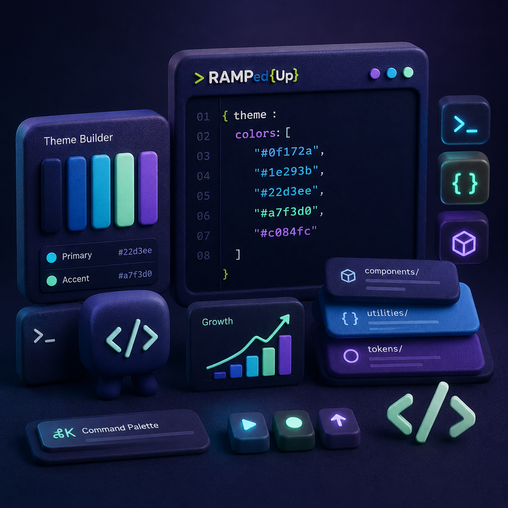

>RAMPed{Up}
### Hey, welcome to >RAMPed{Up}

This started as a straightforward OKLCH color ramp generator — pick a color, get clean tints, shades, and harmony accents out of it. Since then it's gone through a few rounds of changes: a rename, a visual refresh (glass-style backgrounds, 3D-ish swatch tiles), and an attempt at a bigger interactive feature — a "Color Test" mode where you could preview a palette on a room mockup or a fake code editor.

That Color Test feature didn't make it into this build. It ran into repeated drag-and-drop bugs during testing that couldn't be reliably fixed in place, so it's been pulled out for now and is being reworked separately as its own plugin, meant to launch alongside the main app rather than live inside it.

What you're looking at here is the stable core: the ramp generator itself, fully working, without that experimental feature bolted on.

## Here's a walkthrough of everything it can do right now, piece by piece.

# Functionality
Base Color Picker

Pick a starting color, and every tint, shade, and accent in the app builds off it. How to use it: Click the color wheel to choose a color visually, or type exact OKLCH values into the fields next to it. The rest of the app updates instantly.

# Random Base

Generates a random starting color when you don't have one in mind. How to use it: Click the "Random Base" button. Your whole palette regenerates from the new color.

# Curve

Controls how your tint/shade steps are spaced from light to dark. How to use it: Open the Curve dropdown and pick an option (linear, ease-in, ease-out, ease-in-out, or expo). Your Tints and Shades rows update immediately.

# Steps

Sets how many color steps appear in your Tints and Shades rows. How to use it: Type a number between 3 and 12 into the Steps field, or use the arrows. Both rows regenerate right away.

# Harmony

Determines the color-theory rule used to generate your accent colors. How to use it: Open the Harmony dropdown and choose a relationship (complementary, analogous, triadic, split-complementary, tetradic, or monochromatic). Your Harmony Accents row updates automatically.

# Chroma Boost

Scales the saturation of your whole palette up or down. How to use it: Drag the Chroma Boost slider left to mute your palette, or right to make it more vivid. All swatches shift together.

# Hue Shift

Rotates your whole palette around the color wheel. How to use it: Drag the Hue Shift slider to shift every color's hue while keeping their lightness and saturation relationships intact.

# Unlock All

Releases every locked swatch at once. How to use it: Click the "Unlock All" button. Any swatch you'd previously locked becomes editable again.

# Light/Dark Theme Toggle

Switches the app's interface between light and dark mode. How to use it: Click the toggle switch near the top of the app. Only the app's look changes — your palette colors stay the same.

# Tints (Light Scale)

Lighter variations of your base color, generated in OKLCH for even visual spacing. How to use it: No action needed — this row generates automatically from your base color, curve, and steps settings. Adjust those to change it.

# Shades (Dark Scale)

Darker variations of your base color, generated the same way as Tints. How to use it: No action needed — this row updates automatically alongside Tints whenever you change your base color, curve, or steps.

# Harmony Accents

Extra accent colors generated from your chosen Harmony rule. How to use it: No action needed directly — change the Harmony dropdown to regenerate this row with a different color relationship.

# Lock

Freezes an individual swatch so it won't change when you adjust other settings. How to use it: Click the lock icon on any swatch. Click it again to unlock that swatch.

# Contrast Pills (W/B)

Shows each swatch's readability against white and black text, graded by WCAG standards. How to use it: No action needed — look at the "W" and "B" tags under any swatch to see its grade (AAA, AA, or Fail).

# Palette Generator (Vibe)

Generates a full 5-color palette from a mood instead of a specific color. How to use it: Pick a vibe (pastel, vivid, neon, deep, earth, or ocean) from the Palette Generator section, then click any resulting color to set it as your new base color.

## Developer Mode

A collapsible panel showing the raw values behind your current palette. How to use it: Click to expand the Developer Mode section near the bottom of the app to view the underlying data.

**Status**

This is an early build (prototype 1). Expect things to shift around as it grows.

### Made by CodecsDiver
